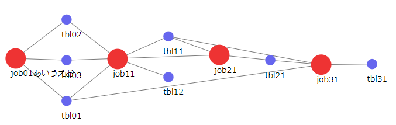

# etl_job_viewer
ETLのジョブを可視化する

# 作ったもの
- JavaScriptでJSON形式のデータから、下記のような絵を描く。

# 背景
- ETLを作ってて、処理とテーブルの関連が複雑になってきて、自動で書いてほしくなったので作ってみました。
- でも上記くらいの規模ならまぁいいですが、複雑になってきたようなETLでは複雑すぎて、全然見えないということがわかりました。
- けどいちおうモノにはなったのでgithubしておきます。

# 参考
- [【JavaScript】D3.jsのforcesimulationを詳しく解説！【node編】](https://keymaso.com/programemory/javascript/d3-forcesimulation2/)
- [D3.jsのforce Graphでノードを左から右へ配置するお話](https://ochanjanai.net/it/development/273)
- [Mobile Patent Suits / D3 / Observable](https://observablehq.com/@d3/mobile-patent-suits)
